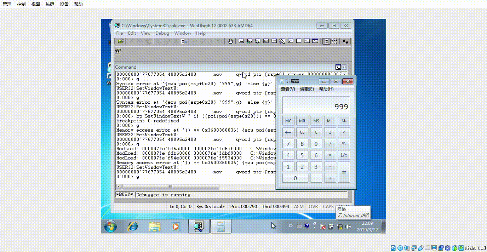

# 第四次作业

## 实验目的

通过调试器监控计算器程序的运行，每当运行结果为666时，就改为999。

## 实验环境

- VirtualBox

- cn_windows_7_professional_with_sp1_vl_build_x64_dvd_u_677816

- calc.exe x64

## 实验过程

1. 下断点，测试按步骤操作时是否调用了`SetWindowTextW`或者`TextOut`函数

        0:010> bp SetWindowTextW
        0:010> bp TextOut

2. 发现调用了`SetWindowTextW`,并发现计算器每次显示出来的数据在`poi(esp+0x20)`处，再次下断点，并在触发断点时查看寄存器内存中的数据

        0:010> bp SetWindowTextW 'du poi(esp+0x20);g'

3. 设置条件中断，监控当运行结果为666时，就改为999

        0:010> bp SetWindowTextW ".if ((poi(poi(esp+0x20))) == 0x3600360036 ) {ezu poi(esp+0x20) \"999\";g} .else {g}"

## 参考资料

- [Conditional breakpoints in WinDbg and other Windows debuggers](https://docs.microsoft.com/en-us/windows-hardware/drivers/debugger/setting-a-conditional-breakpoint)
