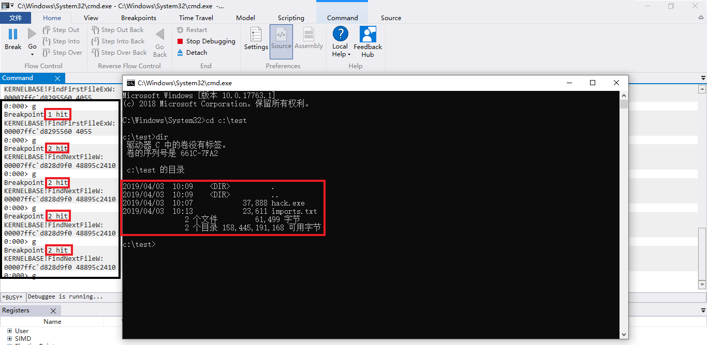

# 第六次作业

## 实验目的

通过API hook的方法，使得cmd的dir命令看不到任意目录下的hacker.exe

## 实验环境

- cn_windows_7_professional_with_sp1_vl_build_x64

- cmd 32位

## 实验过程

- 经过查询资料和 `dumpbin` ，疑似dir在显示目录下文件时调用了如下几个函数

    - FindFirstFileW

    - FindFirstFileExW

    - FindNextFileW

- 使用 `Windbg` 去进行调试，发现 `dir` 调用了其中的两个函数 `FindFirstFileExW` 和 `FindNextFileW`

    

- 查询这两个函数，确实是使用它俩去进行hook

        # lpFileName		目录或路径以及文件名
        # fInfoLevelId	返回数据的信息级别
        # lpFindFileData	指向接收文件数据的缓冲区的指针
        # fSearchOp		要执行的过滤类型与通配符匹配不同
        # lpSearchFilter	如果指定的fSearchOp需要结构化搜索信息，则指向搜索条件的指针
        # dwAdditionalFlags	指定控制搜索的其他标志

        # 如果函数成功，则返回值是在后续调用FindNextFile或 FindClose时使用的搜索句柄 ，
        而 lpFindFileData参数包含有关找到的第一个文件或目录的信息
        # 如果函数失败或无法从lpFileName参数中的搜索字符串中找到文件 ，
        则返回值为 INVALID_HANDLE_VALUE，并且lpFindFileData的内容不确定

        HANDLE FindFirstFileExA(
        LPCSTR             lpFileName,
        FINDEX_INFO_LEVELS fInfoLevelId,
        LPVOID             lpFindFileData,
        FINDEX_SEARCH_OPS  fSearchOp,
        LPVOID             lpSearchFilter,
        DWORD              dwAdditionalFlags
        );

    
        # hFindFile	先前调用FindFirstFile或 FindFirstFileEx函数返回的搜索句柄
        # lpFindFileData	指向WIN32_FIND_DATA结构的指针，该结构接收有关找到的文件或子目录的信息
        # 如果函数成功，则返回值为非零，并且lpFindFileData 参数包含有关找到的下一个文件或目录的信息
        # 如果函数失败，则返回值为零，并且lpFindFileData的内容 不确定
        # 如果函数失败，因为找不到更多匹配的文件， GetLastError函数将返回 ERROR_NO_MORE_FILES

        BOOL FindNextFileA(
        HANDLE             hFindFile,
        LPWIN32_FIND_DATAA lpFindFileData
        );

- 接下来编写程序去进行hook，本次实验的代码可沿用上一次实验的代码。但需要将 [HookFindFileW.cpp](src/6/HookFindFileW.cpp) 中hook的函数修改为本次需要hook的 `FindFirstFileExW` 和 `FindNextFileW`。然后在 [Inject.cpp](src/6/Inject.cpp) 中注入的进程修改为 `cmd.exe`

## 参考资料

- [Windows API 文件系统](http://www.cnblogs.com/mydomain/archive/2011/01/07/1929874.html)
