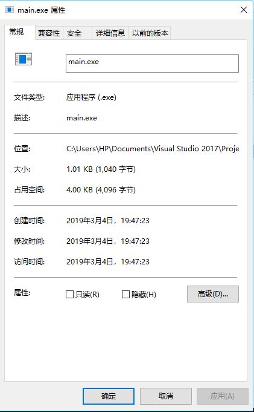
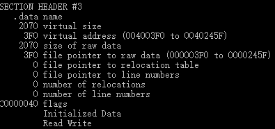
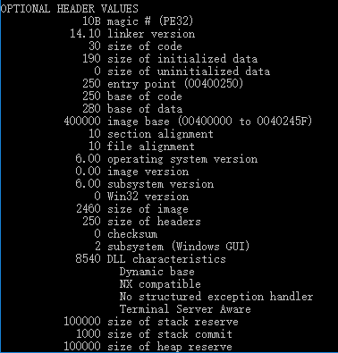
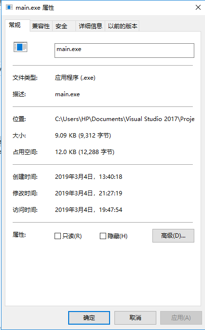
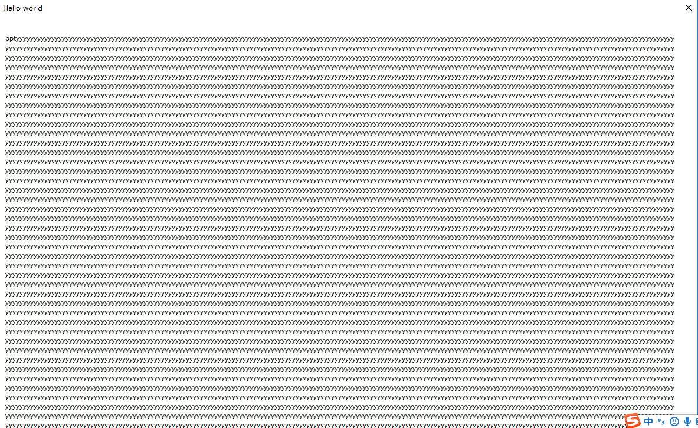

# 第一次作业

## 实验目的

上一题的程序中，修改的显示内容变为一个很长的字符串（至少2kb长）。并且保证程序正常运行不崩溃。

## 实验过程

1. 使用相关命令进行编译产生可执行文件

        cl /nologo /c /TC main.exe

        Link /nologo User32.lib /entry:main /align:16 /subsystem:console main.obj

2. 使用HxD查看.exe，发现有四个section，将最末尾的.reloc删除，并把前面记录的section数从4改为3
在文件末尾添加字符串，修改.data段的的大小

3. 修改header的data标识，修改其大小符合添加后的字符串实际大小

4. .exe文件变大，运行修改后的 .exe文件，程序能正常运行不崩溃

