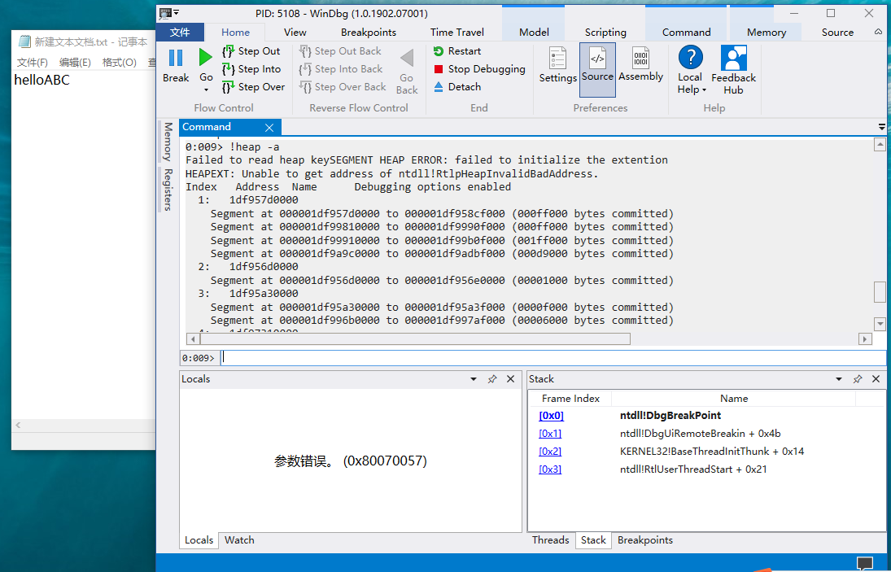

# 第三次作业

## 实验目的

在notepad（32位64位均可）中，输入一段文字。然后使用调试器，在内存中修改这段文字。使得没有在界面操作notepad的修改文字的情况下。notepad中显示的文字变化。

## 实验过程

1. 新建文本，输入内容`helloABC`

2. 打开`WinDbg Preview`，点击`文件 -> start debugging -> Attach to process`，选择正在执行的notepad进程

3. notepad显示的内容一定在内存中，猜测保存在进程堆上，查看notepad.exe已分配的堆

        0:010> !heap -a

4. 挨个搜索一下堆，很巧的是第一个就是

        0:010> s -u 000002b1386f0000 L000ff000 "helloABC"
    

5. 好像找到了相像的字符串，再查看一次

        0:010> du 000002b1`3874a780

6. 接下来修改字符串的内容，并查看内容是否成功修改

        0:010> ezu 000002b1`3874a780 "hellocuc"
        0:010> du 000002b1`3874a780

7. 让进程继续运行，文本文件中的内容已修改

        0:010> g

## 参考资料

- [Windows下调试工具Windbg入门](https://blog.csdn.net/luchengtao11/article/details/82379374)

- [windbg修改notepad内容](https://blog.csdn.net/lixiangminghate/article/details/53086667)