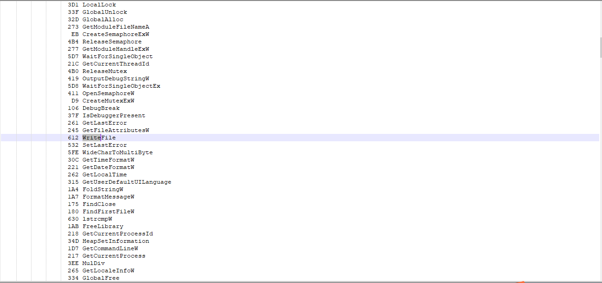
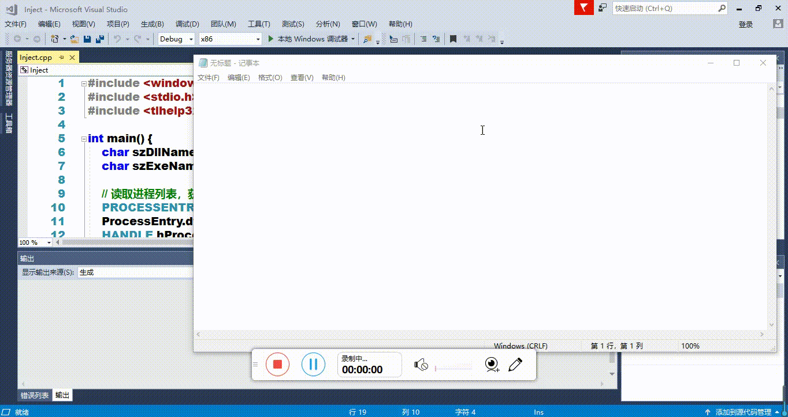

# 第五次作业

## 实验目的

通过API hook的方法，在每次notepad保存txt文件时，就将文件内容修改为： “you have been hacked!”

## 实验环境

- windows10

- notepad 32位

## 实验过程

1. 先去寻找寻找notepad在保存时会调用的API，最后发现调用的是 `WriteFile`

2. 在知道notepad保存会调用的API后，我们就该进行IATHOOK了，使用dll注入的方式去实现hook，当notepad调用 `WriteFile` 函数时去调用假函数，在假函数中去修改参数再调用真函数，用这种方法达到修改内容的目的。IATHOOK的代码主要由[IATHook.cpp](src/5/IATHook.cpp)和[HookWriteFile.cpp](src/5/HookWriteFile.cpp)实现。而用[Inject.cpp](src/5/Inject.cpp)去检测当前系统是否调用notepad进程并决定是否进行IATHOOK

3. 在完成IATHOOK后，notepad在保存时的内容就会被自动替换成我们想要保存的内容了

## 参考资料

- [tinysec/iathook](https://github.com/tinysec/iathook)

- [SecurityOfSoftwareAndSystem](https://github.com/TheMasterOfMagic/SecurityOfSoftwareAndSystem/tree/master/5)
